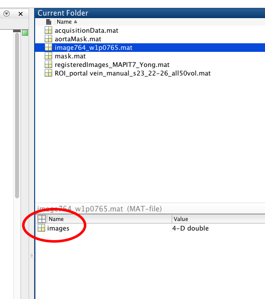

# Reg
Reg is a tool to perform non-linear image registration on 4D volumes in `.mat` format using the FMRIB’s Software Library (FSL) `fnirt` tool.

# Installation
## Reg
The latest version of Reg can be downloaded from [GitHub]. Alternatively, you can also download it from the terminal with the following command:
```console
> git clone https://github.com/sxg/Reg.git
```
Once downloaded, navigate to the folder containing Reg, and run the following command from the terminal to install it:
```console
> pip3 install ./Reg
```
## FSL
Since Reg uses FSL, it must be installed as well. Specific installation instructions are available on [FSL’s website].

# Usage
Full details on all of Reg’s features and options are described in the help message:
```console
> reg --help
```
However, some of the options will be described here.
## Name
Aside from the `.mat` to be registered, this is the only required input. `name` is the name of the image dataset within the `.mat` file that will be registered. An example file and corresponding dataset is shown here in MATLAB:

```console
> reg --name images dataset.mat
```
## FNIRT Path
This parameter specifies where FSL’s `fnirt` tool is installed. The default installation path is `/usr/local/fsl/bin/fnirt`. If left unspecified, Reg will default to this path. If your `fnirt` tool is located elsewhere, you must specify that here. You can find the location of `fnirt` with this command:
```console
> which fnirt
/usr/bin/fsl/fnirt
```
In this case, `fnirt` is not in the default location. When running Reg, `fnirt`’s location must be explicitly included:
```console
> reg --name images --fnirt-path /usr/bin/fsl/fnirt dataset.mat
```
## Output Path
The output path tells Reg where to save the registered dataset. If not specified, Reg will save the dataset in a file named `registeredImages.mat` in your working directory. The `.mat` extension must be included.
```console
> reg --name images --output-path finalImages.mat dataset.mat
```
## Anchors
Anchor volumes (AKA pre-registered volumes) are volumes that do not need to be registered. This parameter allows you to specify which volumes within the 4D time series dataset are anchor volumes. Reg will register non-anchor volumes to the next anchor volume. If left unspecified, Reg assumes the first volume is the one and only anchor volume. You can specify anchor volumes as a comma-separated list of volume numbers.

For example, let’s say the 5th, 17th, and 26th volumes are to be considered anchors in a dataset containing 50 total volumes. In this case, Reg will use `fnirt` to register volumes 1–4 to volume 5, volumes 6–16 to volume 17, volumes 18–25 to volume 26, and volumes 27–50 also to volume 26. You can specify this as shown:
```console
> reg --name images --anchors 5,17,26 dataset.mat
```
